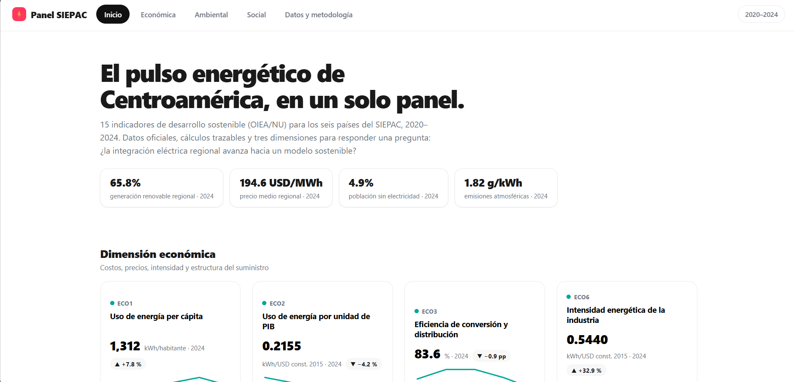
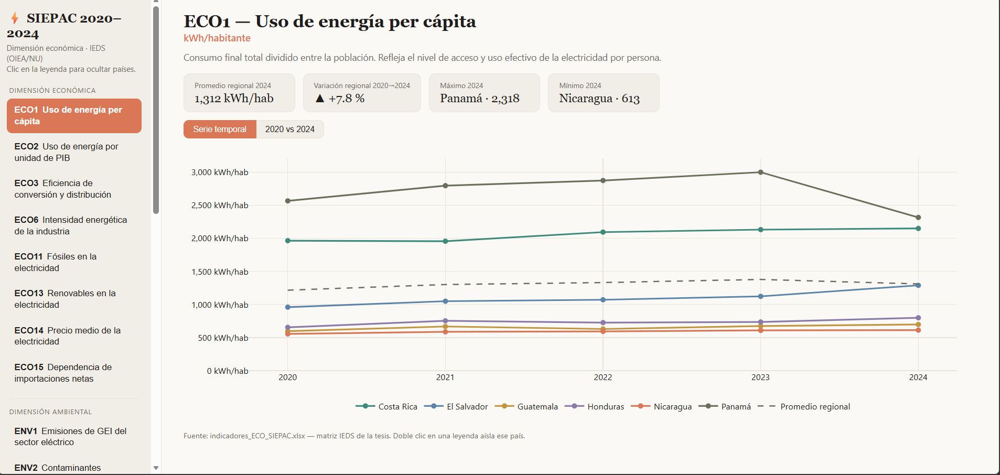
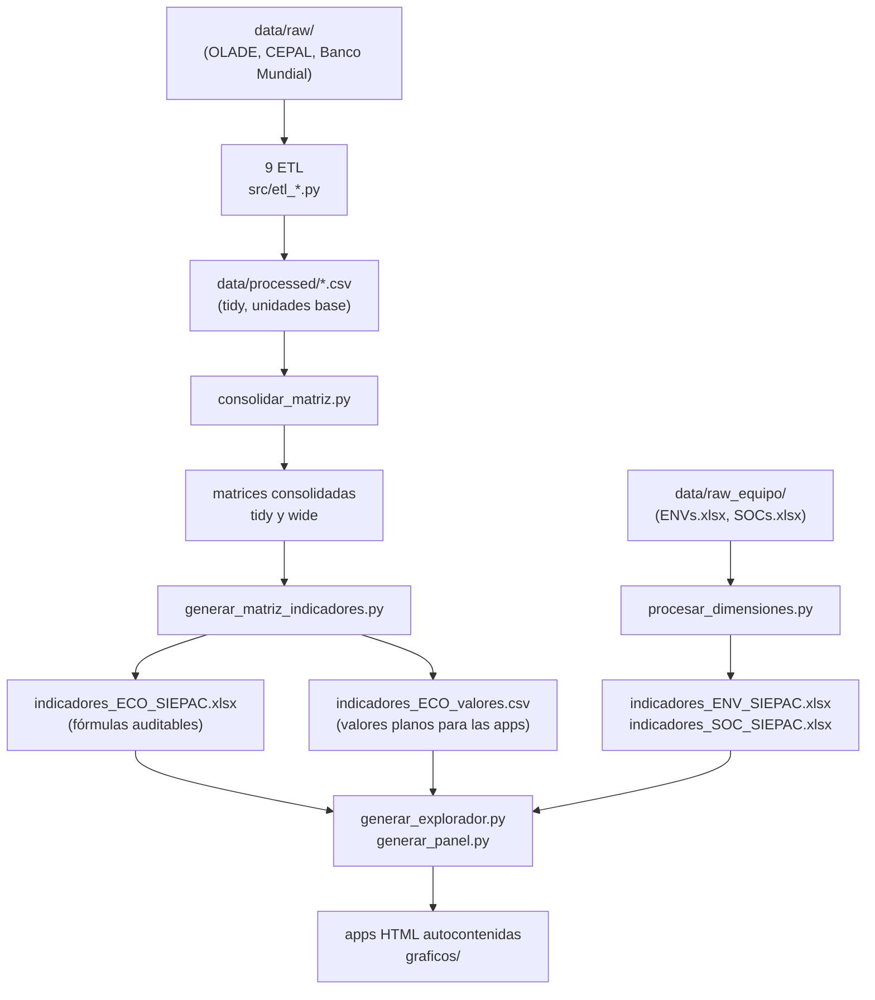

# siepac-analysis

Evaluación del suministro eléctrico en los 6 países del SIEPAC (2020–2024)
mediante Indicadores Energéticos de Desarrollo Sostenible (OIEA/NU, 2005),
en tres dimensiones: económica, social y ambiental.
Tesis de Ingeniería Eléctrica — UNI, Nicaragua.

## Vista previa

Los dos productos finales son apps HTML autocontenidas (en `graficos/`):
un **panel** tipo producto con portada, KPIs y detalle por indicador, y un
**explorador** con menú lateral, tablas de datos base y metodología de
cálculo.





## Pipeline



Las constantes compartidas (países, años, rutas, conversiones) viven en
`src/config_siepac.py`; las utilidades comunes de los ETL, en
`src/etl_comun.py`; el código común de los dos visualizadores, en
`src/viz_comun.py`.

## Requisitos

- Python **3.10 o superior**
- `pip install -r requirements.txt` (pandas, openpyxl, plotly)

## Cómo reproducir

Desde la raíz del proyecto, todo el pipeline con un solo comando:

```
python src/run_pipeline.py
```

O script por script, en este orden:

```
python src/etl_consumo_final_total.py
python src/etl_consumo_industrial.py
python src/etl_poblacion_total.py
python src/etl_pib.py
python src/etl_valor_agregado_industrial.py   # requiere pib.csv, por eso va después
python src/etl_produccion_bruta.py
python src/etl_importaciones_exportaciones.py
python src/etl_tarifa_electrica_media.py
python src/etl_generacion_por_fuente.py
python src/consolidar_matriz.py
python src/generar_matriz_indicadores.py
python src/procesar_dimensiones.py
python src/generar_explorador.py
python src/generar_panel.py
```

Los ETL validan sus salidas y abortan con `VALIDACIÓN FALLIDA` ante errores
graves (nulos, países inesperados, unidades o reconciliaciones que no
cuadran), antes de escribir un CSV corrupto. Los avisos menores (por
ejemplo, un conteo de filas distinto al esperado) se reportan como
`WARNING` sin detener el proceso.

Los dos HTML de `graficos/` son autocontenidos: abren con doble clic,
sin servidor y sin internet (Plotly va embebido).

## Estructura de carpetas

```
siepac-analysis/
├── data/
│   ├── raw/                  # fuentes crudas descargadas (una carpeta por variable,
│   │   │                     #   cada una con su Fuente.txt de trazabilidad)
│   │   ├── consumo_final_total/
│   │   ├── consumo_industrial/
│   │   ├── generacion_por_tipo_de_fuente/
│   │   ├── importaciones_exportaciones/
│   │   ├── pib/
│   │   ├── poblacion_total/
│   │   ├── produccion_bruta/
│   │   ├── tarifa_electrica_media/
│   │   └── valor_agregado_industrial/
│   ├── raw_equipo/           # entregables del equipo (ENVs.xlsx, SOCs.xlsx)
│   └── processed/            # salidas del pipeline (los CSV se regeneran)
├── docs/                     # capturas de pantalla para este README
├── graficos/                 # apps HTML autocontenidas (abren con doble clic)
├── src/                      # todo el código del pipeline
├── requirements.txt
└── LICENSE
```

## Notas metodológicas

- Unidades base del proyecto: energía en kWh, variables macro en USD
  constantes de 2015 (valor entero), tarifa en USD corrientes/MWh,
  población en habitantes.
- Tarifa (ECO14): años faltantes imputados por CAGR de la serie histórica,
  marcados como `imputado_CAGR` y sombreados en el Excel.
- ECO15 negativo = exportador neto (no es un error).
- ECO3 es una aproximación generación → consumo final.
- El Excel de indicadores económicos contiene fórmulas que referencian la
  hoja Datos_Base (auditables celda a celda); los visualizadores leen los
  mismos valores desde `indicadores_ECO_valores.csv`, calculados en pandas
  en paridad con esas fórmulas.

## Cómo contribuir

Cada variable tiene su ETL independiente (`src/etl_<variable>.py`), que lee
solo su carpeta `data/raw/<variable>/` y escribe un único CSV en
`data/processed/`. Para **actualizar datos**: reemplaza el archivo dentro de
la carpeta raw correspondiente (el ETL lo localiza por patrón, no por nombre
exacto), corre ese ETL y luego el resto del pipeline (`python
src/run_pipeline.py` lo hace completo). Para **cambiar la lógica** de una
variable solo se toca su ETL: mientras el CSV de salida conserve las mismas
columnas, el resto del pipeline no cambia. Países, años y rutas se ajustan
una sola vez en `src/config_siepac.py`.

## Fuentes

OLADE/sieLAC, CEPALSTAT, Banco Mundial, EOR/CRIE. Detalle en los
`Fuente.txt` de cada carpeta `data/raw/`.

## Autores

Proyecto desarrollado como tesis de Ingeniería Eléctrica, UNI Nicaragua.

- **Luis Giovanni Serrano Bello** — pipeline de datos, dimensión económica, visualizadores
- **Mariángeles Aracelly Olivares López** — dimensión social
- **Jonathan Noel García Mendoza** — dimensión ambiental

## Licencia

El código se distribuye bajo licencia [MIT](LICENSE). Los datos crudos
pertenecen a sus fuentes (OLADE, CEPAL, Banco Mundial) y se incluyen con
fines académicos y de reproducibilidad, con atribución en los `Fuente.txt`.

## Notas

El aspecto gráfico es un archivo html generado