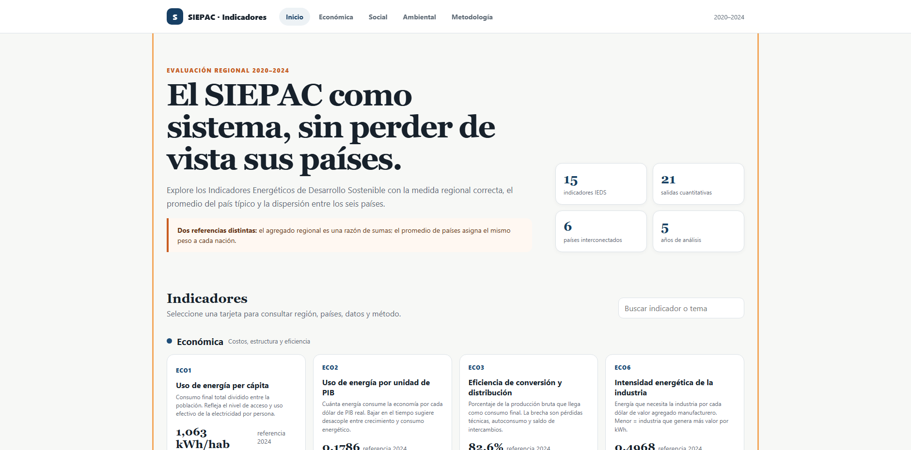
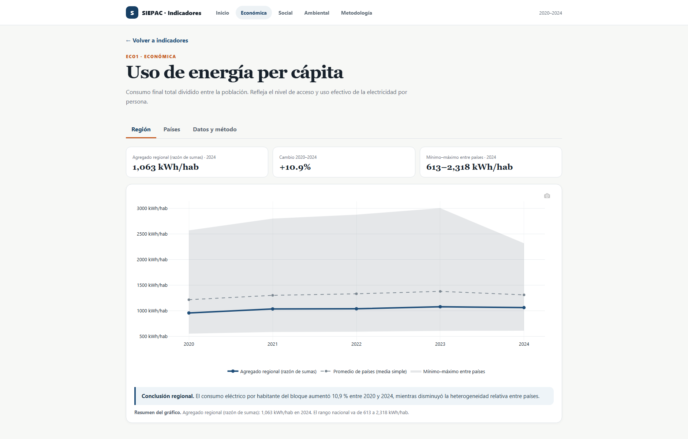
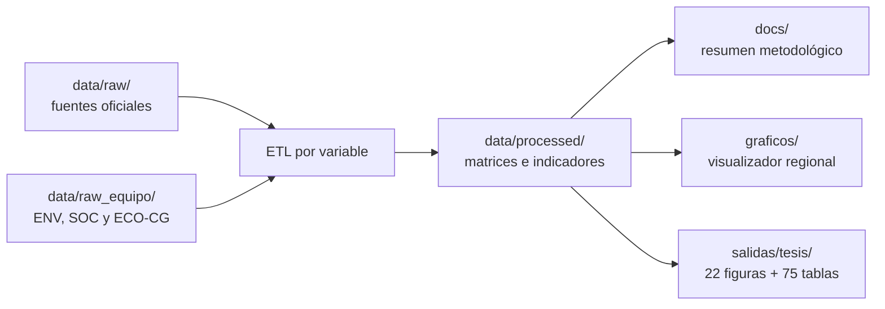

# siepac-analysis

Repositorio trazable y reproducible con acceso a las fuentes de la fase
cuantitativa de la tesis **«Evaluación del
suministro de energía eléctrica en el SIEPAC: perspectivas económicas,
sociales y ambientales»**, desarrollada en la Universidad Nacional de
Ingeniería (UNI), Nicaragua.

El proyecto calcula 15 Indicadores Energéticos de Desarrollo Sostenible
(IEDS) para Guatemala, El Salvador, Honduras, Nicaragua, Costa Rica y Panamá
durante 2020–2024, en las dimensiones económica, social y ambiental.
Distingue explícitamente entre el promedio simple de países
y el agregado regional del SIEPAC.

**Visualizador público:**
[giovanni-serrano.github.io/siepac-analysis](https://giovanni-serrano.github.io/siepac-analysis/)

## Productos

- `graficos/visualizador_siepac.html`: producto regional único; integra
  agregado, promedio, banda mínimo–máximo, conclusiones regionales, países,
  datos y metodología.
- `salidas/tesis/figuras/`: las 22 figuras regionales oficiales usadas por la
  monografía.
- `salidas/tesis/tablas/`: tablas en formato APA 7, incluida la Tabla 7
  regional de SOC2 del cuerpo de la tesis; el índice enlaza las 75 tablas
  dentro de un único HTML consolidado.
- `docs/resumen_indicadores_SIEPAC.md`: ficha metodológica y cifras completas.
- `docs/arquitectura_visualizador_regional.md`: contrato del visualizador
  regional y sus criterios de aceptación.





## Reproducción y límites de acceso

Un clon permite consultar y auditar los HTML, libros procesados, figuras y
tablas versionados. La reproducción completa desde cero requiere obtener ocho
archivos oficiales que no se redistribuyen por las condiciones de sus fuentes.

El entorno verificado usa **Python 3.13.5** (los requisitos fijados requieren
Python ≥3.12). Desde la raíz, crear un entorno e instalar las dependencias:

```bash
python -m venv .venv
```

Activarlo con `.\.venv\Scripts\Activate.ps1` en PowerShell o
`source .venv/bin/activate` en Linux/macOS. Después:

```bash
python -m pip install -r requirements.txt -r requirements-test.txt
python -m pytest tests -q -rs
```

Las pruebas funcionan con los archivos públicos. En un clon limpio se omiten
explícitamente ocho comparaciones de CSV locales regenerables; las demás
pruebas usan fixtures, datos sintéticos, insumos del equipo y productos
versionados. No hace falta ejecutar el pipeline ni instalar un navegador
para esa suite.

Con las ocho fuentes oficiales colocadas según `data/raw/MANIFIESTO.md`:

```bash
python src/verificar_datos_raw.py
python src/run_pipeline.py
```

La exportación PNG de Kaleido requiere Chrome/Chromium disponible en el
entorno; si falta, puede instalarse con `plotly_get_chrome`. Las capturas
opcionales del README usan Playwright y requieren
`python -m playwright install chromium` antes de ejecutar
`python src/generar_capturas_readme.py`.

Los HTML APA siempre se generan. La conversión opcional a DOCX requiere
Windows, PowerShell y Microsoft Word de escritorio con automatización COM
funcional; no requiere `pywin32`. Si falla, se avisa y continúa el pipeline
con los HTML. Para omitirla expresamente:
`python src/generar_tablas_apa.py --sin-docx`.

El orquestador ejecuta los ETL, valida cobertura y unidades, consolida las
matrices, calcula indicadores y regenera el resumen, las tablas, las figuras y
el visualizador HTML. Se detiene ante cualquier validación obligatoria fallida.

El orden completo es:

```text
10 ETL de fuentes oficiales
→ etl_soc2.py
→ consolidar_matriz.py
→ generar_matriz_indicadores.py
→ procesar_dimensiones.py
→ generar_resumen_indicadores.py
→ generar_tablas_apa.py
→ generar_figuras_tesis.py
→ generar_visualizador.py
```

## Flujo de datos


```mermaid
flowchart LR
    RAW["data/raw/<br>fuentes oficiales"] --> ETL["ETL por variable"]
    EQ["data/raw_equipo/<br>ENV, SOC y ECO-CG"] --> ETL
    ETL --> PROC["data/processed/<br>matrices e indicadores"]
    PROC --> DOC["docs/<br>resumen metodológico"]
    PROC --> APP["graficos/<br>visualizador regional"]
    PROC --> OUT["salidas/tesis/<br>22 figuras + 75 tablas"]
```

Las decisiones compartidas se concentran en:

- `src/config_siepac.py`: rutas, países, años y conversiones.
- `src/etl_comun.py`: utilidades comunes de extracción y validación.
- `src/metadatos_indicadores.py`: fichas científicas (`FICHAS`), ponderadores
  y variantes editoriales conservadas en los libros.
- `src/calculos_indicadores.py`: cálculos ECO, agregados y estadísticos.
- `src/datos_dimensiones.py`: lectura de fuentes y preparación ENV/SOC.
- `src/resultados_indicadores.py`: intercambio de resultados comunes sin
  releer los Excel generados.
- `src/presentacion_indicadores.py`: formato y composición de fichas públicas.
- `src/viz_comun.py`: paleta y compatibilidad de imports anteriores.
- `src/figuras_comun.py`: estilo común de las figuras de la tesis.

Las etapas existentes producen tres JSON en `data/processed/`:

| Intermedio | Productor | Contenido |
| --- | --- | --- |
| `resultados_ECO.json` | `generar_matriz_indicadores.py` | Base ECO; valores nacionales en el CSV ECO existente |
| `resultados_ENV.json` | `procesar_dimensiones.py` | Base, series y agregados ENV, incluidas las dos magnitudes ENV6 |
| `resultados_SOC.json` | `procesar_dimensiones.py` | Base, series y agregados SOC |

Son **productos intermedios regenerables, no nuevas fuentes científicas**.
Permanecen ignorados por Git y son consumidos mediante
`resultados_indicadores.py` por resumen, tablas, figuras y visualizador.
Su regeneración requiere los insumos originales, incluidas las fuentes
oficiales que el clon público no distribuye.
Al actualizar desde una versión anterior, ejecutar el mismo pipeline completo
para crearlos antes de invocar por separado los generadores. Los libros siguen
siendo productos auditables; los consumidores ya no dependen de sus hojas ni de
su disposición visual. Los insumos originales del equipo siguen siendo Excel.

La plantilla del visualizador vive en `src/plantillas/visualizador.html`; el
generador incorpora todo su contenido y Plotly al HTML final autocontenido.
El alcance y la validación del refactor están en
[`docs/FASE4_REFACTOR_ARQUITECTURA.md`](docs/FASE4_REFACTOR_ARQUITECTURA.md).

## Datos de entrada

Ocho fuentes oficiales crudas no se redistribuyen porque los términos de
OLADE/SIELAC y CEPAL restringen su publicación. Para reproducir desde cero,
descárgalas siguiendo `data/raw/MANIFIESTO.md` y verifica las copias con:

```bash
python src/verificar_datos_raw.py
```

Los extractos del Banco Mundial incluidos en el repositorio se distribuyen
bajo CC BY 4.0. Los libros y CSV construidos por el equipo viven en
`data/raw_equipo/`:

- `ENVs.xlsx`: datos de la dimensión ambiental.
- `SOCs.xlsx`: SOC1, SOC3 y sus variables base.
- `soc2_agregacion_regional/base_integrada.csv`: fuente canónica de SOC2.
- `eco_cg_siepac.csv`: serie económica complementaria de costo de generación.

## Estructura

```text
siepac-analysis/
├── data/
│   ├── raw/                       # fuentes oficiales por variable
│   ├── raw_equipo/                # insumos elaborados por el equipo
│   └── processed/                 # matrices generadas y auditables
├── docs/                          # documentación y capturas del README
├── graficos/                      # visualizador regional único
├── salidas/tesis/
│   ├── figuras/                   # 22 PNG regionales oficiales
│   └── tablas/                    # tablas APA 7 e índice
├── .github/workflows/             # publicación controlada en GitHub Pages
├── index.html                     # entrada del sitio público
├── src/                           # ETL y generadores
├── tests/                         # pruebas de regresión
├── requirements.txt
└── LICENSE
```

## Criterios metodológicos esenciales

- **Agregado regional:** razón de sumas; representa al SIEPAC como sistema.
- **Promedio de países:** media simple; representa al país típico del bloque.
- **SOC2:** el agregado usa clientes residenciales como proxy de unidades
  consumidoras y calcula una razón de sumas para el ingreso promedio y el
  estrato vulnerable. No equivale a una estimación censal de hogares.
- **SOC3:** los agregados rural y urbano ponderan por sus poblaciones
  respectivas; aproximan el acceso renovable con el mix nacional y no
  observan directamente el consumo de cada hogar.
- **ECO14:** se resume con la mediana de países porque falta el denominador
  regional; 2023–2024 es imputación mediante CAGR.
- **ECO-CG:** serie complementaria, no un noveno indicador económico; sus
  proxies nacionales no forman un costo regional aditivo.
- **ECO15:** un valor negativo representa exportación neta.
- **ENV6:** contrasta dos magnitudes observadas; no calcula un cociente.

La definición de cada indicador se mantiene una sola vez en `FICHAS`, dentro
de `src/metadatos_indicadores.py`. El formato visual se agrega en
`src/presentacion_indicadores.py`, y `viz_comun.FICHAS` conserva el contrato
anterior como reexportación. Los HTML, Excel, PNG, Markdown y tablas son productos
generados: una corrección debe hacerse en el dato o script de origen y luego
regenerarse.

## Pruebas, publicación y trazabilidad

GitHub Actions ejecuta la suite pública en pushes, pull requests dirigidos a
`main` y ejecuciones manuales. Pages solo despliega desde `main` después de
aprobar esas pruebas. Publica los productos versionados mediante una lista
permitida; no reconstruye el pipeline con fuentes ausentes.

La reproducción completa puede verificarse sin sobrescribir productos locales:

```bash
python tests/ejecutar_pipeline_aislado.py --destino .venv/pipeline-verificacion-NUEVA
python -m pytest tests -q --resultados-dir .venv/pipeline-verificacion-NUEVA
```

El destino debe ser nuevo. Consulta [tests/README.md](tests/README.md) para
los contratos de prueba, [la guía metodológica](docs/GUIA_RAPIDA_INDICADORES_SIEPAC.md)
para las agregaciones y [el informe final](docs/FASE5_CIERRE.md) para la
revisión acumulada, la conservación del baseline y los límites de reproducción.

## Autores

- Luis Giovanni Serrano Bello — pipeline, dimensión económica y
  visualizadores.
- Mariángeles Aracelly Olivares López — dimensión social.
- Jonathan Noel García Mendoza — dimensión ambiental.

## Licencia

El código se distribuye bajo [MIT](LICENSE). Los datos crudos conservan las
condiciones de sus fuentes; consulta `data/raw/MANIFIESTO.md`.
