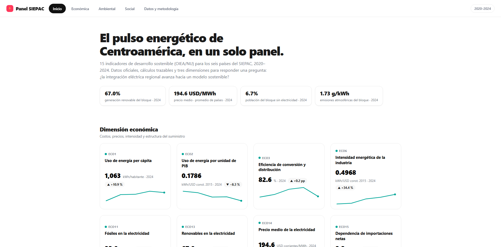
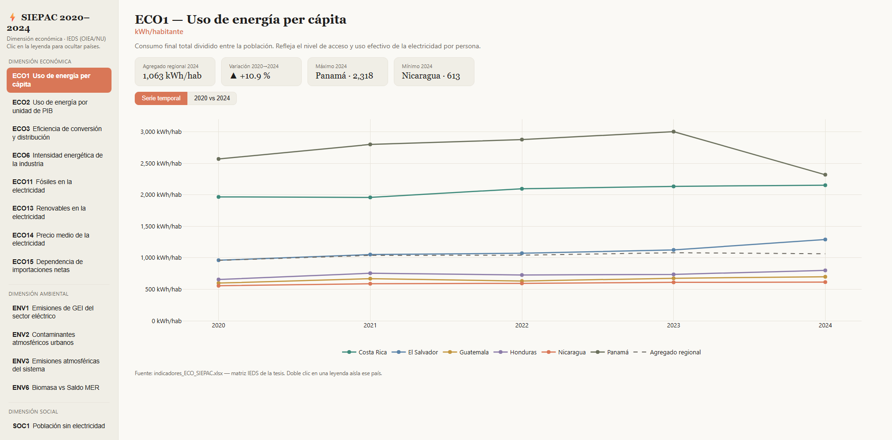
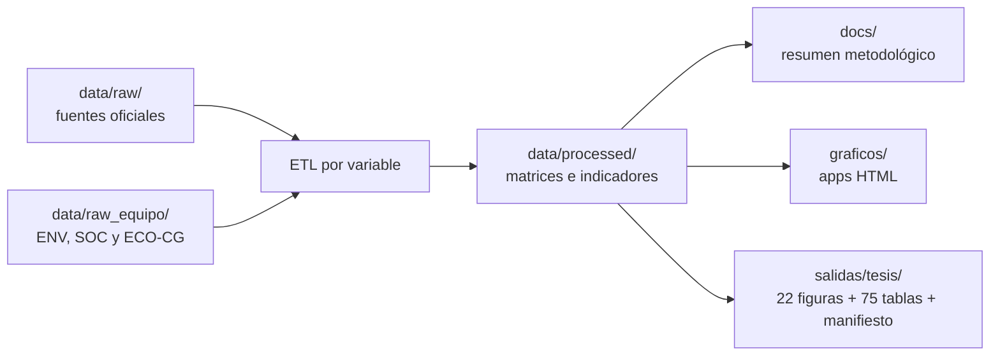

# siepac-analysis

Pipeline reproducible de la fase cuantitativa de la tesis **«Evaluación del
suministro de energía eléctrica en el SIEPAC: perspectivas económicas,
sociales y ambientales»**, desarrollada en la Universidad Nacional de
Ingeniería (UNI), Nicaragua.

El proyecto calcula 15 Indicadores Energéticos de Desarrollo Sostenible
(IEDS) para Guatemala, El Salvador, Honduras, Nicaragua, Costa Rica y Panamá
durante 2020–2024. Distingue explícitamente entre el promedio simple de países
y el agregado regional del SIEPAC.

## Productos

- `graficos/visualizador_siepac.html`: producto regional único; integra
  agregado, promedio, banda mínimo–máximo, países, datos y metodología.
- `graficos/panel_siepac.html`: vista ejecutiva autocontenida.
- `graficos/0_explorador_indicadores.html`: datos, fórmulas y series por
  indicador. Estas dos aplicaciones se conservan temporalmente para comprobar
  paridad antes de retirarlas.
- `salidas/tesis/figuras/`: las 22 figuras regionales oficiales usadas por la
  monografía.
- `salidas/tesis/tablas/`: tablas en formato APA 7, incluida la Tabla 7
  regional de SOC2 del cuerpo de la tesis; el índice enlaza las 75 tablas
  dentro de un único HTML consolidado.
- `salidas/tesis/manifiesto.csv`: inventario generado que relaciona cada
  figura y tabla con su código, título y archivo.
- `docs/resumen_indicadores_SIEPAC.md`: ficha metodológica y cifras completas.
- `docs/arquitectura_visualizador_regional.md`: contrato para consolidar las
  dos apps actuales en un único visualizador regional, sin perder el historial
  del repositorio.





## Reproducción

Requiere Python 3.10 o posterior. Desde la raíz del proyecto:

```bash
pip install -r requirements.txt
python src/run_pipeline.py
```

El orquestador ejecuta los ETL, valida cobertura y unidades, consolida las
matrices, calcula indicadores y regenera tablas, figuras, manifiesto y apps
HTML. Se detiene ante cualquier validación obligatoria fallida.

El orden completo es:

```text
10 ETL de fuentes oficiales
→ etl_soc2.py
→ consolidar_matriz.py
→ generar_matriz_indicadores.py
→ procesar_dimensiones.py
→ generar_resumen_indicadores.py
→ generar_tablas_apa.py
→ generar_figuras_tesis.py
→ generar_manifiesto_tesis.py
→ generar_visualizador.py
→ generar_explorador.py y generar_panel.py (compatibilidad temporal)
```

## Flujo de datos


```mermaid
flowchart LR
    RAW["data/raw/<br>fuentes oficiales"] --> ETL["ETL por variable"]
    EQ["data/raw_equipo/<br>ENV, SOC y ECO-CG"] --> ETL
    ETL --> PROC["data/processed/<br>matrices e indicadores"]
    PROC --> DOC["docs/<br>resumen metodológico"]
    PROC --> APPS["graficos/<br>apps HTML"]
    PROC --> OUT["salidas/tesis/<br>22 figuras + 75 tablas + manifiesto"]
```

Las decisiones compartidas se concentran en:

- `src/config_siepac.py`: rutas, países, años y conversiones.
- `src/etl_comun.py`: utilidades comunes de extracción y validación.
- `src/viz_comun.py`: fichas metodológicas (`FICHAS`), agregados y paleta.
- `src/figuras_comun.py`: estilo común de las figuras de la tesis.

## Datos de entrada

Ocho fuentes oficiales crudas no se redistribuyen porque los términos de
OLADE/SIELAC y CEPAL restringen su publicación. Para reproducir desde cero,
descárgalas siguiendo `data/raw/MANIFIESTO.md` y verifica las copias con:

```bash
python src/verificar_datos_raw.py
```

Los extractos del Banco Mundial incluidos en el repositorio se distribuyen
bajo CC BY 4.0. Los libros y CSV construidos por el equipo viven en
`data/raw_equipo/`:

- `ENVs.xlsx`: datos de la dimensión ambiental.
- `SOCs.xlsx`: SOC1, SOC3 y sus variables base.
- `soc2_agregacion_regional/base_integrada.csv`: fuente canónica de SOC2.
- `eco_cg_siepac.csv`: serie económica complementaria de costo de generación.

## Estructura

```text
siepac-analysis/
├── data/
│   ├── raw/                       # fuentes oficiales por variable
│   ├── raw_equipo/                # insumos elaborados por el equipo
│   └── processed/                 # matrices generadas y auditables
├── docs/                          # documentación y capturas del README
├── graficos/                      # visualizador regional + apps transitorias
├── salidas/tesis/
│   ├── figuras/                   # 22 PNG regionales oficiales
│   ├── tablas/                    # tablas APA 7 e índice
│   └── manifiesto.csv             # inventario de entrega
├── src/                           # ETL y generadores
├── tests/                         # pruebas de regresión
├── requirements.txt
└── LICENSE
```

## Criterios metodológicos esenciales

- **Agregado regional:** razón de sumas; representa al SIEPAC como sistema.
- **Promedio de países:** media simple; representa al país típico del bloque.
- **SOC2:** el agregado usa clientes residenciales como proxy de unidades
  consumidoras y calcula una razón de sumas para el ingreso promedio y el
  estrato vulnerable. No equivale a una estimación censal de hogares.
- **ECO14:** se resume con la mediana de países porque falta el denominador
  regional; 2023–2024 es imputación mediante CAGR.
- **ECO-CG:** serie complementaria, no un noveno indicador económico; sus
  proxies nacionales no forman un costo regional aditivo.
- **ECO15:** un valor negativo representa exportación neta.
- **ENV6:** contrasta dos magnitudes observadas; no calcula un cociente.

La definición de cada indicador se mantiene una sola vez en `FICHAS`, dentro
de `src/viz_comun.py`. Los HTML, Excel, PNG, Markdown y tablas son productos
generados: una corrección debe hacerse en el dato o script de origen y luego
regenerarse.

## Autores

- Luis Giovanni Serrano Bello — pipeline, dimensión económica y
  visualizadores.
- Mariángeles Aracelly Olivares López — dimensión social.
- Jonathan Noel García Mendoza — dimensión ambiental.

## Licencia

El código se distribuye bajo [MIT](LICENSE). Los datos crudos conservan las
condiciones de sus fuentes; consulta `data/raw/MANIFIESTO.md`.
